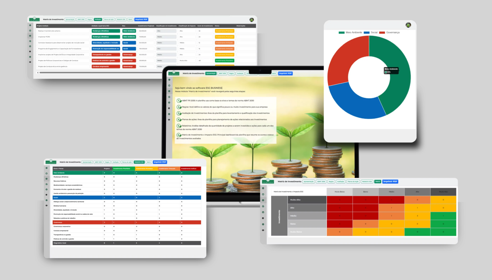
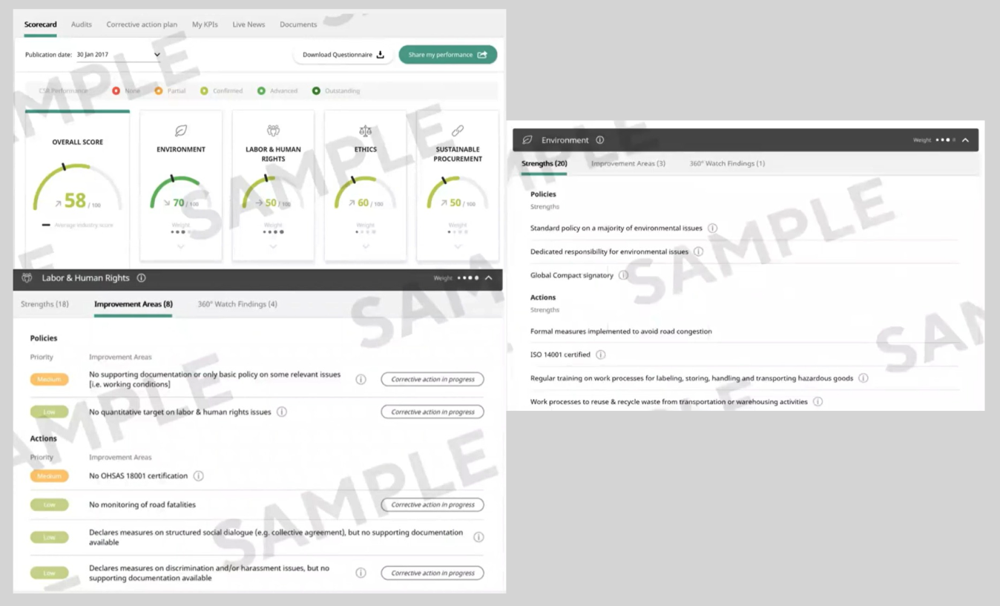
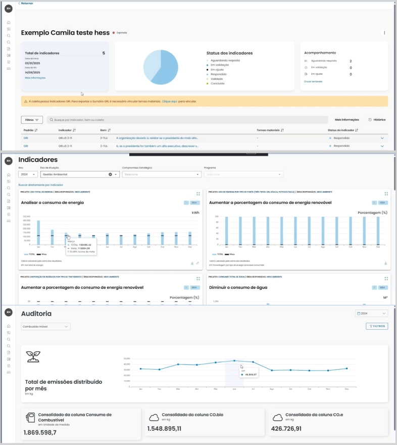
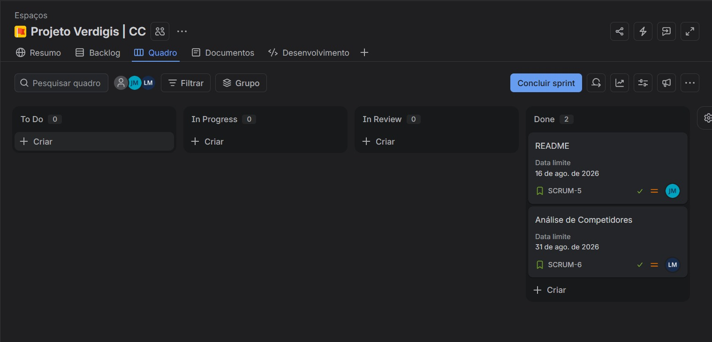

# 🌿 Projeto Verdigis

> **Desafio Proposto pela Deloitte:** Como aumentar a percepção de importância e impulsionar a aplicação de práticas ESG nas Pequenas e Médias Empresas (PMEs)?

---

## 📌 Visão Geral do Projeto

O **Projeto Verdigis** foi desenvolvido a partir de um desafio corporativo apresentado pela **Deloitte**. O objetivo principal é criar estratégias e soluções para ampliar a conscientização, desmistificar e acelerar a adoção das diretrizes **ESG** (*Environmental, Social, and Governance*) no ambiente das pequenas e médias empresas.

Embora o ESG tenha se tornado indispensável no mercado corporativo global, grande parte das PMEs ainda enxerga essas práticas como um custo inacessível ou algo exclusivo de grandes corporações. Este projeto busca mudar essa perspectiva, demonstrando o valor estratégico e financeiro da sustentabilidade corporativa.

---

## 📊 Contexto e Panorama do Mercado

As PMEs representam a espinha dorsal da economia, contudo enfrentam uma grande lacuna de informação e maturidade sobre ESG:

- 📈 **26,5% do PIB Nacional:** Impacto econômico direto gerado pelas micro, pequenas e médias empresas.
- 💼 **80% dos Empregos Gerados:** Maior força empregadora do mercado de trabalho.
- ❓ **67% sem Conhecimento Formal:** Não sabem o significado da sigla ESG, embora **já exerçam práticas sustentáveis e sociais em seu dia a dia** de forma intuitiva.

### Por que o ESG deixou de ser opcional?

A régua de decisão do mercado mudou radicalmente nos últimos anos:

1. **Investidores Globais:** Fundos de investimento utilizam rigorosos critérios ESG para alocação de aportes.
2. **Instituições Financeiras:** Bancos oferecem **linhas de crédito com condições e taxas de juros mais favoráveis** para empresas sustentáveis.
3. **Grandes Corporações:** Passaram a exigir conformidade ESG em toda a sua cadeia de **fornecedores e parceiros**.
4. **Consumidores:** Priorizam marcas transparentes, éticas e com responsabilidade ambiental e social.

---

## ⚠️ Dores, Barreiras e Riscos das PMEs

### Barreiras para a Adoção:
* **Custo Percebido:** Impressão de que ESG é apenas um custo extra sem retorno garantido.
* **Sobrevivência em 1º Lugar:** Foco total na gestão de caixa de curto prazo e emergências diárias.
* **Falta de Conhecimento e Complexidade:** Ausência de direcionamento prático sobre por onde começar.
* **Retorno "Invisível":** Dificuldade em mensurar o ROI (Retorno sobre Investimento) das ações socioambientais.
* **Ausência de Exigência Direta Percebida:** Acreditar que a cobrança recai apenas sobre multinacionais.

### Riscos da Não-Adoção (Consequências para o Negócio):
* 📉 **Contratos Perdidos:** Desqualificação em concorrências e perda de grandes clientes.
* 💸 **Crédito Mais Caro:** Dificuldade em obter financiamentos competitivos.
* ⚠️ **Reputação Exposta:** Vulnerabilidade a sanções e crises de imagem.
* 🚪 **Fuga de Talentos:** Perda de atratividade para novos profissionais e lideranças.

---

## 🎯 Objetivos do Projeto

- [x] **Traduzir e Desmistificar:** Converter os pilares ESG em linguagem simples e aplicável à realidade das PMEs.
- [x] **Mapear Práticas Intuitivas:** Ajudar empresários a reconhecer, mensurar e valorizar ações que já realizam no cotidiano.
- [x] **Evidenciar Retorno:** Demonstrar os ganhos em reputação, acesso a capital, eficiência operacional e novos contratos.

---

## 🛠️ Tecnologias e Ferramentas

*(Ajuste com a stack técnica exata do seu projeto)*

- **Linguagens / Análise de Dados:** HTML, CSS, Javascript, Python (Django), SQL
- **Ambiente de Desenvolvimento:** VS Code
- **Documentação:** Markdown / LaTeX

---
## Entrega 01:
## 1. Análise Individual de Competidores

### 1.1. Paresi
* **Descrição do Funcionamento:** Atua como uma ferramenta de diagnóstico de maturidade. O usuário preenche dados e responde a perguntas sobre as práticas da empresa, e a plataforma gera um panorama inicial com indicadores e orientações para os próximos passos.
* **Pontos Fortes:**
  * Oferece um excelente direcionamento inicial por meio de diagnósticos estruturados, ajudando a empresa a entender por onde começar sua jornada ESG.
* **Pontos Fracos:**
  * O dashboard pode ser visualmente cansativo e confuso. O uso excessivo de cores e o acúmulo de métricas na mesma tela dificultam a priorização de ações.
* **Fotos:**
  

---

### 1.2. Orkea
* **Descrição do Funcionamento:** É uma plataforma de monitoramento contínuo. Ela avalia o desempenho da empresa dividindo-o em pilares ESG, gera uma nota (score) e emite alertas para ajudar na gestão e acompanhamento das metas traçadas.
* **Pontos Fortes:**
  * A jornada do usuário é fluida e bem explicada. O uso de pontuações e benchmarks facilita o entendimento do desempenho.
* **Pontos Fracos:**
  * A profundidade técnica de alguns indicadores exige um esforço maior de interpretação, o que pode ser uma barreira para equipes que estão tendo o primeiro contato com o tema.
* **Fotos:**
  

---

### 1.3. ESG Business (Negócios ESG)
* **Descrição do Funcionamento:** Focada em desmistificar o tema, funciona como um painel de controle simplificado. Ajuda empresas de menor porte ou em estágio inicial a organizar informações e acompanhar métricas básicas de sustentabilidade de forma direta.
* **Pontos Fortes:**
  * Destaca-se pela simplicidade. A linguagem sem jargões e o dashboard com baixo esforço cognitivo tornam a ferramenta muito amigável para o dia a dia.
* **Pontos Fracos:**
  * A página inicial peca pelo excesso de elementos simultâneos e a falta de padronização nas imagens, tirando um pouco da consistência profissional da interface.
* **Fotos:**
  

---

### 1.4. EcoVadis
* **Descrição do Funcionamento:** A plataforma de avaliação é baseada em evidências. A empresa preenche um questionário customizado para seu setor/tamanho e faz upload de documentos comprovando suas ações.
* **Pontos Fortes:**
  * Alta credibilidade; possui interface intuitiva, com excelente hierarquia visual e uso inteligente de blocos, reduzindo drasticamente a carga cognitiva.
* **Pontos Fracos:**
  * Por ser rigorosa e baseada em evidências, a jornada de preenchimento e envio de documentos comprobatórios é longa e trabalhosa.
* **Fotos:**
  

---

### 1.5. Deep ESG (ESG Profundo)
* **Descrição do Funcionamento:** É um software de mensuração profunda e geração de relatórios. Ele coleta e cruza grandes volumes de dados da empresa para automatizar cálculos complexos, como inventário de carbono, gerando relatórios padronizados exigidos por investidores e pelo mercado financeiro.
* **Pontos Fortes:**
  * Altamente analítica e robusta. Destaca-se pela automação de dados e forte alinhamento com os principais frameworks globais de sustentabilidade (como GRI e GHG Protocol).
* **Pontos Fracos:**
  * Curva de aprendizado alta. A densidade das tabelas, a linguagem técnica e a grande quantidade de formulários no setup inicial podem assustar usuários menos experientes.
* **Fotos:**
  

# Análise de Similares (Benchmarking)

| Controles | Clareza do primeiro acesso e orientação | Linguagem | Facilidade para iniciantes | Dashboard | Carga cognitiva | Pontos fortes | Pontos fracos | Funcionamento | Fotos |
| :--- | :--- | :--- | :--- | :--- | :--- | :--- | :--- | :--- | :---: |
| **Paresi** | Proposta de valor clara, CTA evidente e navegação organizada. Entretanto, possui alguns termos técnicos no início. | Linguagem clara e objetiva, mas alguns termos técnicos e siglas podem dificultar a compreensão de usuários iniciantes em ESG. | Boa, porque oferece sua proposta, indicadores estruturados e recursos que orientam o usuário. | Muita informação e uso excessivo de cores podem dificultar a identificação das informações prioritárias. | Atenção, porque há muitos indicadores, métricas e conceitos no dashboard que podem exigir processamento maior. | Oferece um excelente direcionamento inicial por meio de diagnósticos estruturados, ajudando a empresa a entender por onde começar sua jornada ESG. | O dashboard pode ser visualmente cansativo e confuso. O uso excessivo de cores e o acúmulo de métricas na mesma tela dificultam a priorização de ações. | Atua como uma ferramenta de diagnóstico de maturidade. O usuário preenche dados e responde a perguntas sobre as práticas da empresa, e a plataforma gera um panorama inicial com indicadores e orientações para próximos passos. |  |
| **Orkea** | Proposta clara, navegação objetiva e próximos passos bem indicados. | Linguagem clara e de fácil entendimento, embora algumas referências técnicas possam ser desconhecidas por iniciantes. | Boa; a plataforma explica sua proposta, funcionamento e diferenciais de forma clara e fluida. | Apresenta score, pilares ESG, benchmarks e alertas, facilitando o acompanhamento do desempenho. | A variedade de indicadores e referenciais no dashboard pode exigir esforço de interpretação, principalmente para usuários iniciantes. | A jornada do usuário é fluida, explicando muito bem sua proposta. O uso de pontuações e benchmarks facilita o entendimento do desempenho. | A profundidade técnica de alguns indicadores exige um esforço maior de interpretação, o que pode ser uma barreira para equipes que estão tendo o primeiro contato com o tema. | É uma plataforma de monitoramento contínuo. Ela avalia o desempenho da empresa dividindo-o em pilares ESG, gera uma nota e emite alertas para ajudar na gestão e acompanhamentos das metas traçadas. |  |
| **ESG business** | Proposta clara e fácil de identificar, porém a página apresenta muitos elementos visuais simultaneamente. | Linguagem simples, direta e com poucas siglas, facilitando a compreensão. | Explica a proposta de forma clara, facilitando a compreensão de usuários iniciantes. | Informações bem organizadas e cores equilibradas, mas algumas imagens prejudicam a consistência visual. | Baixo esforço no dashboard, mas a página inicial apresenta muitos elementos, podendo aumentar a carga cognitiva. | Destaca-se pela simplicidade. A linguagem sem jargões e o dashboard com baixo esforço cognitivo tornam a ferramenta muito amigável para o dia a dia. | A página inicial peca pelo excesso de elementos simultâneos e a falta de padronização nas imagens, tirando um pouco da consistência profissional da interface. | Focada em desmistificar o tema, funciona como um painel de controle simplificado. Ajuda empresas de menor porte ou em estágio inicial a organizar informações e acompanhar métricas básicas de sustentabilidade de forma direta. |  |
| **EcoVadis** | Site bem estruturado, com boa organização visual e contraste, facilitando a compreensão. | Linguagem clara e acessível, com pouca utilização de termos técnicos na apresentação inicial. | Interface intuitiva e informações organizadas, facilitando a compreensão por iniciantes. | Informações bem organizadas, com boa hierarquia visual, ícones intuitivos e uso equilibrado de cores. | Baixa carga cognitiva, devido à organização das informações em blocos, uso equilibrado de cores e quantidade reduzida de informações por seção. | Alta credibilidade possui interface intuitiva, com excelente hierarquia visual e uso inteligente de blocos, reduzindo drasticamente a carga cognitiva. | Por ser rigorosa e baseada em evidências, a jornada de preenchimento e envio de documentos comprobatórios é longa e trabalhosa. | A plataforma de avaliação é baseada em evidências. A empresa preenche um questionário customizado para seu setor/tamanho e faz upload de documentos comprovando suas ações. |  |
| **Deep ESG** | Proposta de valor focada em métricas e automação de dados ESG. Apresenta tour inicial claro, porém o setup de entrada exige o preenchimento de diversos formulários de cadastro. | Linguagem técnica e focada em indicadores ambientais/sociais, utilizando siglas de mercado (GRI, GHG Protocol) que exigem conhecimento prévio. | Moderada; a plataforma oferece bom suporte e modelos guiados, mas a complexidade da coleta de dados de entrada exige curva de aprendizado inicial. | Visualização analítica rica com relatórios, gráficos de emissões e progresso de metas, permitindo boa navegação e exportação de dados. | Moderada a alta, devido à grande densidade de dados numéricos, gráficos e tabelas quantitativas apresentadas em poucas telas. | Altamente analítica e robusta. Destaca-se pela automação de dados e forte alinhamento com os principais frameworks globais de sustentabilidade (como GRI e GHG Protocol). | Curva de aprendizado alta. A densidade das tabelas, a linguagem técnica e a grande quantidade de formulários no setup inicial podem assustar usuários menos experientes. | É um software de mensuração profunda e geração de relatórios. Ele coleta e cruza grandes volumes de dados da empresa para automatizar cálculos complexos, como inventário de carbono, gerando relatórios padronizados exigidos por investidores e pelo mercado financeiro. | 

# Requisitos não triviais
1) O usuário deve conseguir estabelecer metas ESG e o sistema deve comparar automaticamente os resultados registrados com essas metas.
2) O sistema deve manter um histórico das alterações realizadas nos indicadores, registrando quem realizou a alteração, quando ocorreu e quais dados foram modificados.
3) Criar um algoritmo que atribua uma pontuação geral de ESG para a empresa com base nos indicadores cadastrados.
4) Trazer um algoritmo que permita que o sistema compare automaticamente o desempenho da empresa entre períodos.

## Entrega 02:

## Entrega 03:

## Entrega 04:

## ✒️ Grupo e Créditos

### Integrantes:
| Nome | E-mail |
| :--- | :--- |
| Ana Luiza Carvalho Xavier | alcx@cesar.school |
| Carlos Henrique Corrêa de Araujo | chcass@cesar.school |
| Carlos Vinicius Encarnação do Nascimento | cven@cesar.school |
| João Pedro dos Santos Menezes | jpsm4@cesar.school |
| João Marcelo Franca da Costa Casado | jmfcc@cesar.school |
| Lucas de Moura Mattos | lmm7@cesar.school |
| Matheus Raulino de Souza Moreira | mrsm@cesar.school |
| Pétala Kiara da Silva | pks@cesar.school |
| Thácio Soares Miranda dos Santos | tsms2@cesar.school |
| Vitória de Assis Seabra | vas4@cesar.school |

### Parceiro do Desafio:
- **Deloitte**
