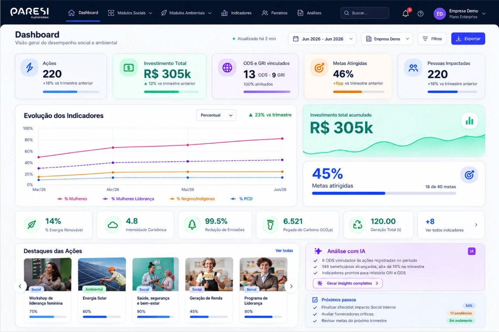
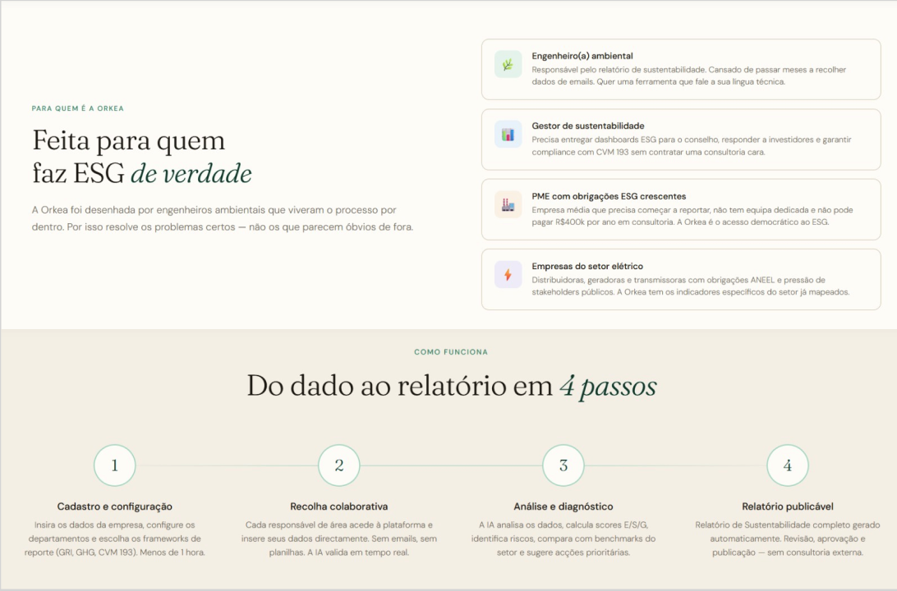

## Introdução
* Esta análise mapeia os principais concorrentes no mercado de soluções ESG com o objetivo de compreender suas ofertas, estratégias de posicionamento e diferenciais competitivos. O material serve como referência para identificar oportunidades de mercado, orientar o aprimoramento da nossa proposta de valor e fundamentar decisões estratégicas do produto.

## 1. Análise Individual de Competidores

### 1.1. Paresi
* **Visão Geral e Funcionamento:**  A Paresi é uma climatech / ESG tech brasileira voltada para a gestão de iniciativas e dados de sustentabilidade corporativa. Atua como uma ferramenta de diagnóstico de maturidade. O usuário preenche dados e responde a perguntas sobre as práticas da empresa, e a plataforma gera um panorama inicial com indicadores e orientações para os próximos passos.
* **Pontos Fortes:**
  * Oferece um excelente direcionamento inicial por meio de diagnósticos estruturados, ajudando a empresa a entender por onde começar sua jornada ESG.
* **Pontos Fracos:**
  * O dashboard pode ser visualmente cansativo e confuso. O uso excessivo de cores e o acúmulo de métricas na mesma tela dificultam a priorização de ações.
* **Fotos:**
  

---

### 1.2. Orkea
* **Visão Geral e Funcionamento:** A Orkea é uma empresa/plataforma voltada para soluções digitais de governança, sustentabilidade e gestão corporativa. É uma plataforma de monitoramento contínuo. Ela avalia o desempenho da empresa dividindo-o em pilares ESG, gera uma nota (score) e emite alertas para ajudar na gestão e acompanhamento das metas traçadas.
* **Pontos Fortes:**
  * A jornada do usuário é fluida e bem explicada. O uso de pontuações e benchmarks facilita o entendimento do desempenho.
* **Pontos Fracos:**
  * A profundidade técnica de alguns indicadores exige um esforço maior de interpretação, o que pode ser uma barreira para equipes que estão tendo o primeiro contato com o tema.
* **Fotos:**
  

---

### 1.3. ESG Business (Negócios ESG)
* **Visão Geral e Funcionamento:** ESG Business refere-se a modelos de negócios voltados para a prestação de serviços de consultoria, capacitação, educação corporativa e implementação de estratégias ESG para empresas. Focada em desmistificar o tema, funciona como um painel de controle simplificado. Ajuda empresas de menor porte ou em estágio inicial a organizar informações e acompanhar métricas básicas de sustentabilidade de forma direta.
* **Pontos Fortes:**
  * Destaca-se pela simplicidade. A linguagem sem jargões e o dashboard com baixo esforço cognitivo tornam a ferramenta muito amigável para o dia a dia.
* **Pontos Fracos:**
  * A página inicial peca pelo excesso de elementos simultâneos e a falta de padronização nas imagens, tirando um pouco da consistência profissional da interface.
* **Fotos:**
  

---

### 1.4. EcoVadis
* **Visão Geral e Funcionamento:** A EcoVadis é uma das maiores e mais reconhecidas plataformas globais de avaliação e classificação (rating) de sustentabilidade para cadeias de suprimentos. A plataforma de avaliação é baseada em evidências. A empresa preenche um questionário customizado para seu setor/tamanho e faz upload de documentos comprovando suas ações.
* **Pontos Fortes:**
  * Alta credibilidade; possui interface intuitiva, com excelente hierarquia visual e uso inteligente de blocos, reduzindo drasticamente a carga cognitiva.
* **Pontos Fracos:**
  * Por ser rigorosa e baseada em evidências, a jornada de preenchimento e envio de documentos comprobatórios é longa e trabalhosa.
* **Fotos:**
  

---

### 1.5. Deep ESG (ESG Profundo)
* **Visão Geral e Funcionamento:** A DeepESG é uma startup e plataforma de tecnologia brasileira especializada em mensuração de impactos e descarbonização. É um software de mensuração profunda e geração de relatórios. Ele coleta e cruza grandes volumes de dados da empresa para automatizar cálculos complexos, como inventário de carbono, gerando relatórios padronizados exigidos por investidores e pelo mercado financeiro.
* **Pontos Fortes:**
  * Altamente analítica e robusta. Destaca-se pela automação de dados e forte alinhamento com os principais frameworks globais de sustentabilidade (como GRI e GHG Protocol).
* **Pontos Fracos:**
  * Curva de aprendizado alta. A densidade das tabelas, a linguagem técnica e a grande quantidade de formulários no setup inicial podem assustar usuários menos experientes.
* **Fotos:**
  

# Análise de Similares (Benchmarking)

| Controles | Clareza do primeiro acesso e orientação | Linguagem | Facilidade para iniciantes | Dashboard | Carga cognitiva | Pontos fortes | Pontos fracos | Funcionamento | Fotos |
| :--- | :--- | :--- | :--- | :--- | :--- | :--- | :--- | :--- | :---: |
| **Paresi** | Proposta de valor clara, CTA evidente e navegação organizada. Entretanto, possui alguns termos técnicos no início. | Linguagem clara e objetiva, mas alguns termos técnicos e siglas podem dificultar a compreensão de usuários iniciantes em ESG. | Boa, porque oferece sua proposta, indicadores estruturados e recursos que orientam o usuário. | Muita informação e uso excessivo de cores podem dificultar a identificação das informações prioritárias. | Atenção, porque há muitos indicadores, métricas e conceitos no dashboard que podem exigir processamento maior. | Oferece um excelente direcionamento inicial por meio de diagnósticos estruturados, ajudando a empresa a entender por onde começar sua jornada ESG. | O dashboard pode ser visualmente cansativo e confuso. O uso excessivo de cores e o acúmulo de métricas na mesma tela dificultam a priorização de ações. | Atua como uma ferramenta de diagnóstico de maturidade. O usuário preenche dados e responde a perguntas sobre as práticas da empresa, e a plataforma gera um panorama inicial com indicadores e orientações para próximos passos. |  |
| **Orkea** | Proposta clara, navegação objetiva e próximos passos bem indicados. | Linguagem clara e de fácil entendimento, embora algumas referências técnicas possam ser desconhecidas por iniciantes. | Boa; a plataforma explica sua proposta, funcionamento e diferenciais de forma clara e fluida. | Apresenta score, pilares ESG, benchmarks e alertas, facilitando o acompanhamento do desempenho. | A variedade de indicadores e referenciais no dashboard pode exigir esforço de interpretação, principalmente para usuários iniciantes. | A jornada do usuário é fluida, explicando muito bem sua proposta. O uso de pontuações e benchmarks facilita o entendimento do desempenho. | A profundidade técnica de alguns indicadores exige um esforço maior de interpretação, o que pode ser uma barreira para equipes que estão tendo o primeiro contato com o tema. | É uma plataforma de monitoramento contínuo. Ela avalia o desempenho da empresa dividindo-o em pilares ESG, gera uma nota e emite alertas para ajudar na gestão e acompanhamentos das metas traçadas. |  |
| **ESG business** | Proposta clara e fácil de identificar, porém a página apresenta muitos elementos visuais simultaneamente. | Linguagem simples, direta e com poucas siglas, facilitando a compreensão. | Explica a proposta de forma clara, facilitando a compreensão de usuários iniciantes. | Informações bem organizadas e cores equilibradas, mas algumas imagens prejudicam a consistência visual. | Baixo esforço no dashboard, mas a página inicial apresenta muitos elementos, podendo aumentar a carga cognitiva. | Destaca-se pela simplicidade. A linguagem sem jargões e o dashboard com baixo esforço cognitivo tornam a ferramenta muito amigável para o dia a dia. | A página inicial peca pelo excesso de elementos simultâneos e a falta de padronização nas imagens, tirando um pouco da consistência profissional da interface. | Focada em desmistificar o tema, funciona como um painel de controle simplificado. Ajuda empresas de menor porte ou em estágio inicial a organizar informações e acompanhar métricas básicas de sustentabilidade de forma direta. |  |
| **EcoVadis** | Site bem estruturado, com boa organização visual e contraste, facilitando a compreensão. | Linguagem clara e acessível, com pouca utilização de termos técnicos na apresentação inicial. | Interface intuitiva e informações organizadas, facilitando a compreensão por iniciantes. | Informações bem organizadas, com boa hierarquia visual, ícones intuitivos e uso equilibrado de cores. | Baixa carga cognitiva, devido à organização das informações em blocos, uso equilibrado de cores e quantidade reduzida de informações por seção. | Alta credibilidade possui interface intuitiva, com excelente hierarquia visual e uso inteligente de blocos, reduzindo drasticamente a carga cognitiva. | Por ser rigorosa e baseada em evidências, a jornada de preenchimento e envio de documentos comprobatórios é longa e trabalhosa. | A plataforma de avaliação é baseada em evidências. A empresa preenche um questionário customizado para seu setor/tamanho e faz upload de documentos comprovando suas ações. |  |
| **Deep ESG** | Proposta de valor focada em métricas e automação de dados ESG. Apresenta tour inicial claro, porém o setup de entrada exige o preenchimento de diversos formulários de cadastro. | Linguagem técnica e focada em indicadores ambientais/sociais, utilizando siglas de mercado (GRI, GHG Protocol) que exigem conhecimento prévio. | Moderada; a plataforma oferece bom suporte e modelos guiados, mas a complexidade da coleta de dados de entrada exige curva de aprendizado inicial. | Visualização analítica rica com relatórios, gráficos de emissões e progresso de metas, permitindo boa navegação e exportação de dados. | Moderada a alta, devido à grande densidade de dados numéricos, gráficos e tabelas quantitativas apresentadas em poucas telas. | Altamente analítica e robusta. Destaca-se pela automação de dados e forte alinhamento com os principais frameworks globais de sustentabilidade (como GRI e GHG Protocol). | Curva de aprendizado alta. A densidade das tabelas, a linguagem técnica e a grande quantidade de formulários no setup inicial podem assustar usuários menos experientes. | É um software de mensuração profunda e geração de relatórios. Ele coleta e cruza grandes volumes de dados da empresa para automatizar cálculos complexos, como inventário de carbono, gerando relatórios padronizados exigidos por investidores e pelo mercado financeiro. | 

# Requisitos não triviais
1) O usuário deve conseguir estabelecer metas ESG e o sistema deve comparar automaticamente os resultados registrados com essas metas.
2) O sistema deve manter um histórico das alterações realizadas nos indicadores, registrando quem realizou a alteração, quando ocorreu e quais dados foram modificados.
3) Criar um algoritmo que atribua uma pontuação geral de ESG para a empresa com base nos indicadores cadastrados.
4) Trazer um algoritmo que permita que o sistema compare automaticamente o desempenho da empresa entre períodos.
